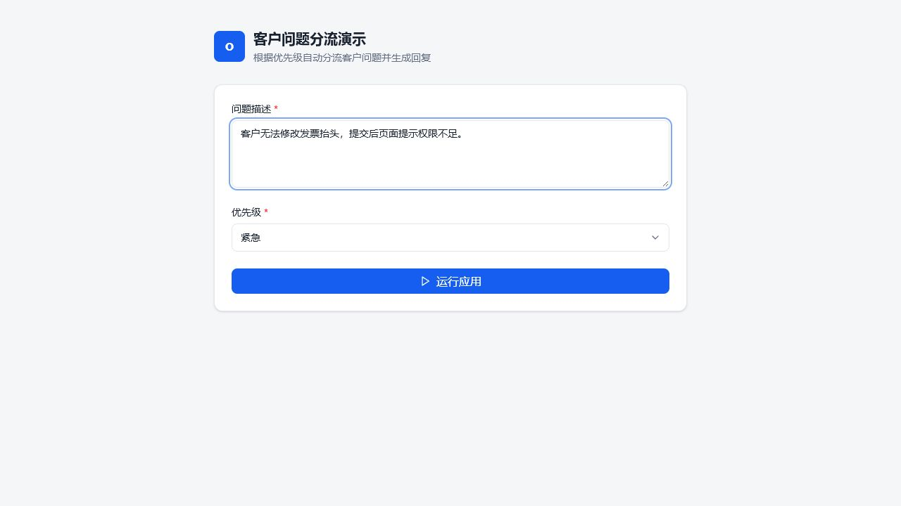
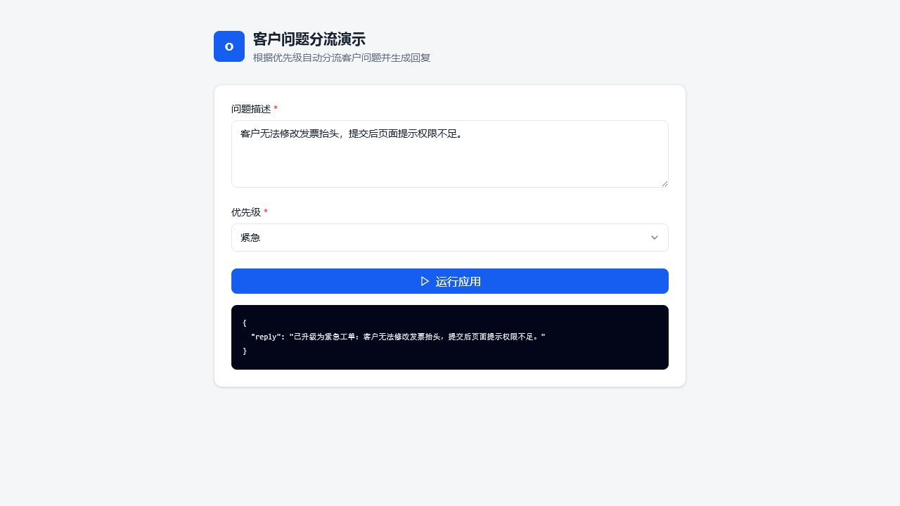
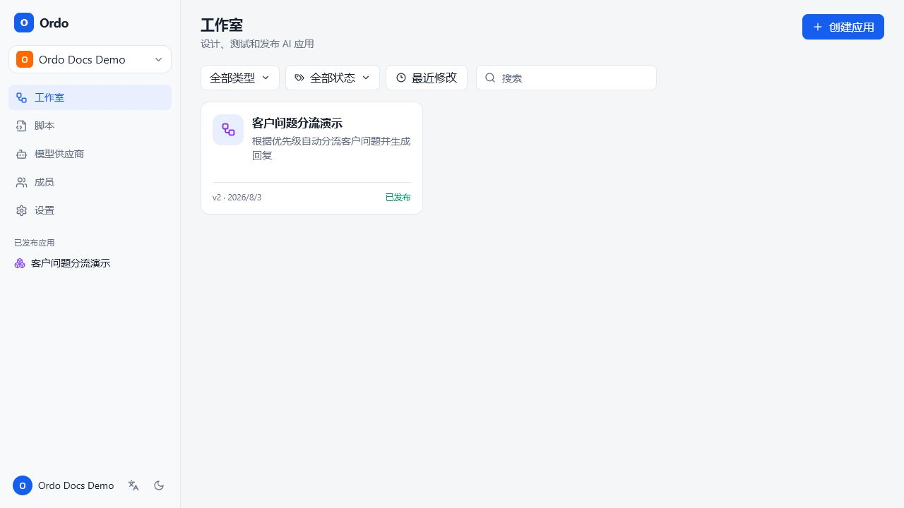
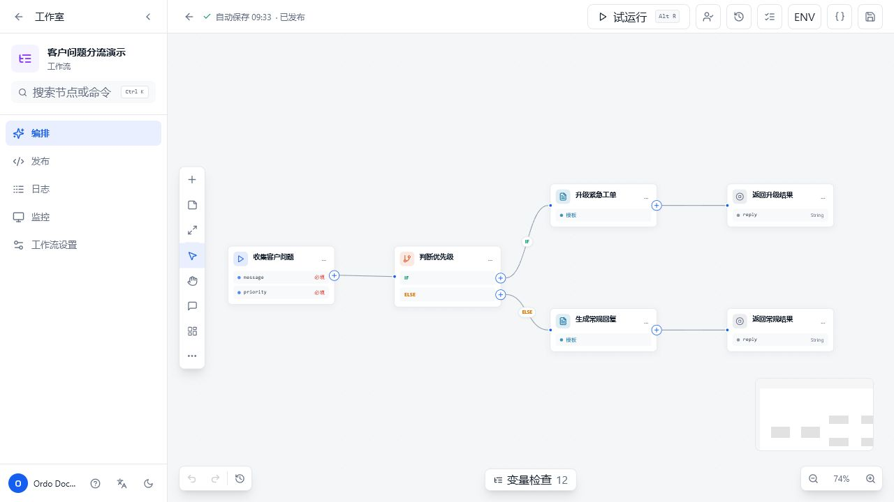
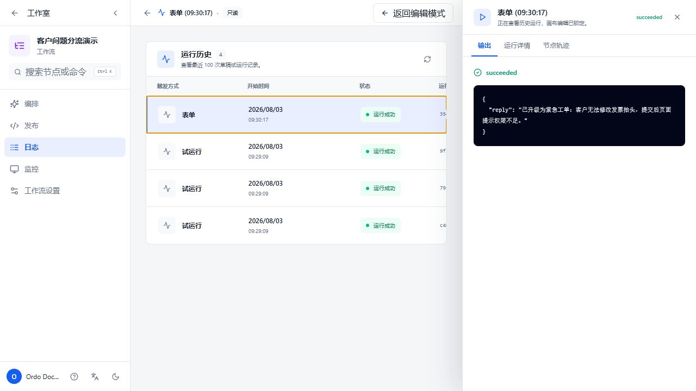
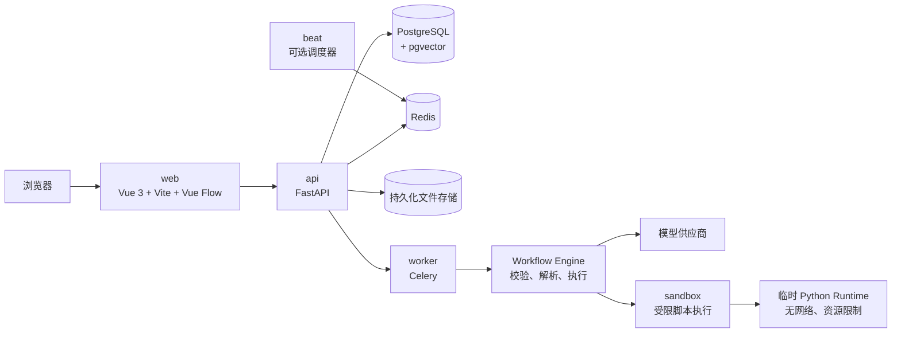

# Ordo

**Visual AI Workflow Studio**

Ordo 是一个可自托管的、多工作区 AI 工作流平台。它把可视化编排、模型调用、Python 脚本、文档处理和公开应用发布放在同一套运行时中，适合把一次性的 AI 试验整理成可复用、可审计、可发布的业务流程。

## 目录

- [产品能力](#产品能力)
- [运行截图](#运行截图)
- [系统架构](#系统架构)
- [快速启动](#快速启动)
- [第一次使用](#第一次使用)
- [公开应用与 API](#公开应用与-api)
- [配置说明](#配置说明)
- [开发与测试](#开发与测试)
- [运维与安全](#运维与安全)
- [项目结构](#项目结构)
- [故障排查](#故障排查)

## 产品能力

| 模块 | 能力 |
| --- | --- |
| 工作室 | 多工作区、工作流卡片、草稿/已发布筛选、搜索和发布状态管理 |
| 可视化设计器 | 通过 Vue Flow 连接开始、结束、条件、分类、LLM、图片、模板、代码、脚本、HTTP、文档、循环和人工审批等节点 |
| 版本与发布 | 草稿自动保存、版本历史、恢复、发布备注、公开/受保护访问策略 |
| 运行时 | Celery 队列、节点级执行、SSE 运行事件、运行历史、节点轨迹、输出下载 |
| 公开应用 | 表单、API、Webhook 入口；工作流 slug 作为稳定的公开地址 |
| Python 脚本 | 多文件 `.py`/ZIP、入口函数、JSON Schema 输入输出、异步测试、日志、取消、版本差异和恢复 |
| 模型供应商 | OpenAI-compatible 连接、模型目录、连接测试、工作流引用和能力配置 |
| 文档处理 | DOCX 文本/图片提取，以及按稳定段落锚点插入答案并下载生成文件 |
| 配置与协作 | 工作区成员、角色、环境变量、加密凭据、系统变量、评论和审批 |
| 运维观测 | `/health`、Prometheus `/metrics`、`X-Request-ID`、JSON 日志、OTLP/HTTP 链路和失败告警 Webhook |

知识库节点目前已退役；需要检索增强时，应通过 HTTP、脚本或模型供应商节点接入外部服务。

## 运行截图

以下截图来自一次隔离的 `Ordo Docs Demo` 演示工作区，使用的是临时生成的演示账号、工作流和运行记录，不代表仓库当前已有业务数据。

### 公开表单



### 公开运行结果



### 工作室



### 可视化编排



### 运行历史与详情



## 系统架构



一次工作流运行的生命周期是：

```text
设计草稿 -> graph 校验 -> 创建 pending run -> Redis/Celery 排队
        -> worker 执行节点 -> SSE 推送事件 -> 持久化 trace/output -> Studio 或公开应用展示
```

### 服务与端口

| 服务 | 作用 | 默认端口 |
| --- | --- | --- |
| `web` | Vue 静态资源与前端入口 | `5173` |
| `api` | 管理 API、公开应用 API、Swagger | `8000` |
| `worker` | 工作流和脚本测试执行 | 内部服务 |
| `beat` | 定时工作流派发，可选 profile | 内部服务 |
| `postgres` | 工作区、工作流、运行记录和向量数据 | 内部服务 |
| `redis` | Celery broker/backend 与运行事件 | 内部服务 |
| `sandbox` | 受限 Python 执行控制面 | 内部服务 |

## 快速启动

### 前置条件

- Docker Desktop，支持 Docker Compose v2
- 至少 4 GB 可用内存；启用脚本节点时建议 8 GB+
- 如果不使用容器开发后端：Python 3.12+
- 如果不使用容器开发前端：Node.js 20+

### Docker Compose

```powershell
Copy-Item .env.example .env
# 编辑 .env，至少替换 APP_SECRET_KEY、CREDENTIAL_ENCRYPTION_KEY、SANDBOX_SHARED_SECRET

docker compose up --build -d
docker compose ps
```

启动后访问：

- Web：<http://localhost:5173>
- API 文档：<http://localhost:8000/docs>
- 健康检查：<http://localhost:8000/health>
- 指标：<http://localhost:8000/metrics>

定时工作流需要额外启动 beat：

```powershell
docker compose --profile schedule up -d beat
```

停止服务但保留卷：

```powershell
docker compose down
```

删除数据卷会清除 PostgreSQL、Redis、文件和 sandbox artifact 数据，请在执行前完成备份：

```powershell
docker compose down -v
```

API 容器启动时会自动执行 `alembic upgrade head`，不需要手动创建数据库表。

### 本地开发

后端：

```powershell
.\scripts\enable-proxy.ps1
Set-Location backend
python -m venv .venv
.\.venv\Scripts\python.exe -I -m pip install -e ".[dev]"
$env:DATABASE_URL = "sqlite+aiosqlite:///./dev.db"
.\.venv\Scripts\python.exe -I -m app.bootstrap
.\.venv\Scripts\python.exe -I -m uvicorn app.main:app --reload
```

前端：

```powershell
.\scripts\enable-proxy.ps1
Set-Location frontend
npm install
npm run dev
```

Vite 会把 `/api` 和 `/v1` 请求代理到 `http://localhost:8000`。

## 第一次使用

1. 打开 <http://localhost:5173>，注册账号；注册时会自动创建个人工作区。
2. 在工作室新建应用，选择空白工作流或英语试卷模板。
3. 在画布中配置开始节点输入字段，拖入节点并连接分支。
4. 点击“试运行”检查输入、节点输出和运行轨迹；草稿运行不会改变已发布版本。
5. 在“发布”中填写变更说明，选择公开或受保护访问策略。
6. 发布后，从“日志”查看历史运行，从“监控”查看最近状态；公开应用可从 `https://<host>/apps/<slug>` 访问。

### 节点选择建议

| 需求 | 推荐节点 |
| --- | --- |
| 固定格式回复或拼接文本 | 模板 |
| 调用对话模型 | LLM；需要结构化结果时配置 JSON Schema |
| 图片生成 | 图片 |
| 复用 Python 逻辑 | 脚本；复杂或外部依赖优先上传 ZIP |
| 读取 DOCX | 文档，选择文本或图片提取 |
| 修改原始 DOCX 并下载 | 脚本中的内置答案填充器 |
| 分支、循环和审批 | 条件、分类、循环、迭代、人工审批 |
| 对接内部系统 | HTTP 或脚本 |

## 公开应用与 API

管理 API 使用 `/api/v1` 前缀；公开应用 API 使用 `/v1` 前缀。

### 公开入口

| 入口 | 方法 | 说明 |
| --- | --- | --- |
| `/v1/apps/{slug}` | `GET` | 读取公开应用元数据和输入字段 |
| `/v1/apps/{slug}/form` | `POST` | 表单触发工作流 |
| `/v1/apps/{slug}/run` | `POST` | API 触发工作流 |
| `/v1/apps/{slug}/webhook` | `POST` | Webhook 触发工作流 |
| `/v1/apps/{slug}/runs/{run_id}` | `GET` | 获取运行状态和输出 |
| `/v1/apps/{slug}/runs/{run_id}/events` | `GET` | SSE 运行事件流 |
| `/v1/apps/{slug}/files` | `POST` | 上传公开运行所需文件 |

一个受保护 API 应用的最小调用示例：

```powershell
$body = @{ inputs = @{ message = "请总结本周工单" } } | ConvertTo-Json
Invoke-RestMethod `
  -Method Post `
  -Uri "http://localhost:5173/v1/apps/<app-slug>/run" `
  -Headers @{ Authorization = "Bearer owf_<workspace-api-key>" } `
  -ContentType "application/json" `
  -Body $body
```

API key 通过管理端点创建，明文只在创建响应中返回：

```text
POST /api/v1/workspaces/{workspace_id}/api-keys
```

发布时如果选择受保护访问，可以配置登录用户、工作区成员或密码授权；未授权请求不会进入工作流执行阶段。

## 配置说明

复制 `.env.example` 后按部署环境修改。不要把真实密钥提交到 Git。

| 变量 | 用途 | 备注 |
| --- | --- | --- |
| `APP_ENV` | 运行环境 | `development` / `production` |
| `APP_SECRET_KEY` | JWT 等应用签名 | 至少 32 个随机字符 |
| `CREDENTIAL_ENCRYPTION_KEY` | 模型凭据静态加密 | 使用 Fernet key |
| `DATABASE_URL` | SQLAlchemy 异步数据库地址 | Compose 默认 PostgreSQL |
| `REDIS_URL` | Celery 和事件流 | Compose 默认 Redis |
| `STORAGE_PATH` | 上传和生成文件目录 | 容器内默认 `/data/files` |
| `SANDBOX_URL` | sandbox 控制面地址 | 脚本节点依赖 |
| `SANDBOX_SHARED_SECRET` | API 与 sandbox 间共享密钥 | 与应用密钥分开 |
| `MAX_REQUEST_BODY_BYTES` | 请求体大小上限 | 默认 50 MiB |
| `CORS_ORIGINS` | 允许的前端来源 | 生产环境请收紧 |
| `HOST_HTTP_PROXY` / `CONTAINER_HTTP_PROXY` | 依赖安装和镜像构建代理 | 无代理时可清空 |
| `OTEL_EXPORTER_OTLP_ENDPOINT` | OTLP/HTTP trace 导出 | 可选 |
| `ALERT_WEBHOOK_URL` | 失败/未处理异常通知 | 可选 |
| `LOG_LEVEL` | 日志级别 | 默认 `INFO` |

## 开发与测试

后端测试和 Ruff：

```powershell
Set-Location backend
.\.venv\Scripts\python.exe -I -m pytest tests -p no:cacheprovider
.\.venv\Scripts\python.exe -I -m ruff check app tests
```

前端测试和构建：

```powershell
Set-Location frontend
npm test
npm run build
```

数据库结构变更使用 Alembic：

```powershell
Set-Location backend
alembic revision --autogenerate -m "describe the change"
alembic upgrade head
```

不要用 `Base.metadata.create_all` 更新已部署数据库。新增迁移后，至少验证 API 启动、健康检查和一条真实工作流运行。

## 运维与安全

- PostgreSQL、Redis、sandbox API 默认只加入 Compose 内部网络；对外只暴露 web 和 api。
- sandbox 通过受限 Docker socket proxy 启动临时运行容器：非 root、无 Linux capabilities、只读应用文件系统、独立 `/tmp`、PID/内存/CPU 限制，默认禁用网络。
- 每次脚本执行使用独立的临时容器层，不与其他任务共享卷；sandbox 不应访问数据库、Redis 或文件存储写端点。
- 模型供应商凭据在数据库中加密保存，API 响应不返回明文；工作区资源的授权在服务端执行。
- `file-data`、`postgres-data`、`redis-data` 和 `sandbox-artifacts` 是持久化卷。迁移、升级或清理前先做可恢复备份。
- 生产部署请替换所有示例密钥，配置 HTTPS、收紧 `CORS_ORIGINS`，并将 `/metrics` 限制在监控网络内。
- 运行创建后初始状态可能是 `pending`；以事件流和最终运行详情为准，不要把入队成功当成业务执行成功。

## 项目结构

```text
.
├─ backend/
│  ├─ app/api/routes/       # auth、workspaces、workflows、scripts、models、public
│  ├─ app/services/         # workflow engine、storage、sandbox、document、events
│  ├─ app/models/           # SQLAlchemy 实体
│  ├─ app/script_sources/   # 内置脚本源代码
│  ├─ alembic/              # 数据库迁移
│  └─ tests/
├─ frontend/
│  ├─ src/pages/            # Studio、Designer、Scripts、Models、Public App
│  ├─ src/components/       # AppShell、节点、面板和输出渲染器
│  ├─ src/stores/           # auth、workspace、preferences
│  └─ src/volt/             # 本地 UI 基础组件
├─ sandbox/                 # 受限脚本控制面和运行镜像
├─ infra/postgres/          # PostgreSQL 初始化脚本
├─ scripts/                 # 本地代理等辅助脚本
├─ docker-compose.yml
└─ .env.example
```

## 故障排查

### 页面打开但 API 报错

确认 API 健康状态和 web 依赖顺序：

```powershell
docker compose ps
Invoke-WebRequest -UseBasicParsing http://localhost:8000/health
docker compose logs --tail=100 api web
```

### 运行一直停留在 `pending`

确认 worker、Redis 都在运行，并查看任务日志：

```powershell
docker compose ps worker redis
docker compose logs --tail=200 worker redis
```

### 脚本节点无法执行

检查 `sandbox` 和 `sandbox-docker-proxy` 是否健康，以及 `SANDBOX_SHARED_SECRET` 是否一致。sandbox 不可用时，脚本执行会被安全地禁用，而不是回退到 API 容器内执行。

### 镜像构建下载依赖失败

检查 `HOST_HTTP_PROXY`、`CONTAINER_HTTP_PROXY` 和 `NO_PROXY`；本地 Windows 环境可以先执行：

```powershell
.\scripts\enable-proxy.ps1
```

### 修改代码后界面仍是旧版本

容器运行模式下重新构建 web，并在浏览器中硬刷新：

```powershell
docker compose build web
docker compose up -d --no-deps web
```

## 许可

本项目使用仓库根目录 [LICENSE](LICENSE) 中的许可条款。
